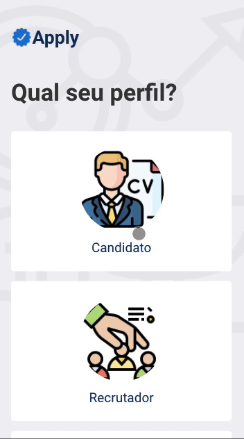

# Apply

## What's it?
This is a project to simulate R&S context. This was built with TypeScript, React and Webpack (without creat-react-app).

## Sample

## Requirements:
1. `node 12.22.11 or >`

## Running the project:

1. `launch the API service at http://localhost:8080/`
2. `cd apply`
3. `yarn`
4. `yarn dev`
5. `open http://localhost:3000/`